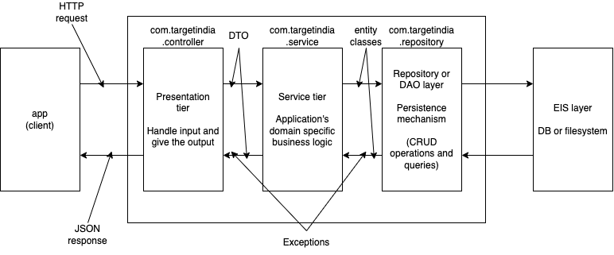

# Java Notes

## Need to declare variables before using it

- associate a data type to a variable
- Data types:
  - Primitives (keywords)
    - `byte` 1 byte (java.lang.Byte)
    - `short` 2 bytes (java.lang.Short)
    - `int` 4 bytes (java.lang.Integer)
    - `long` 8 bytes (java.lang.Long)
    - `float` 4 bytes (java.lang.Float)
    - `double` 8 bytes (java.lang.Double)
    - `char` 2 bytes (java.lang.Character)
    - `boolean` 1 bit (java.lang.Boolean)
  - References (8 bytes)
    - class
    - interface
    - enum
    - record
    - @interface (annotation)

## Programming constructs

- selction: `if-else`, `switch-case`
- iteration (loops): `for`, `while`, `do-while`
- sequence (branching): function calls

## Some rules:

- a class is the minimum building block
- a class is a container for variables (data members) and functions (methods)
  - optionally a class may contain other class definitions
- members may have access modifiers: `public`, `protected`, `private`
  - if none of them are used, that is called `package level`

## Multi-tier architecture

## OOP

- Major elements

  - Abstraction: Hide the implementation details
  - Encapsulation: Restrict access to some members and provide access to those from other members
  - Hierarchy: Arrangement of classes based on their association with each other
    - Aggregation: whole-part assoication (HAS-A)
      - Composition: A stronger form of aggregation
    - Inheritance: A class is a derivative of another (Parent/Child or Super/Sub or Base/Derived)
  - Modularity

- Minor elements
  - Typing
  - Concurrency
  - Persistence
